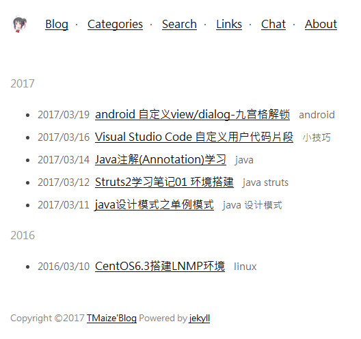
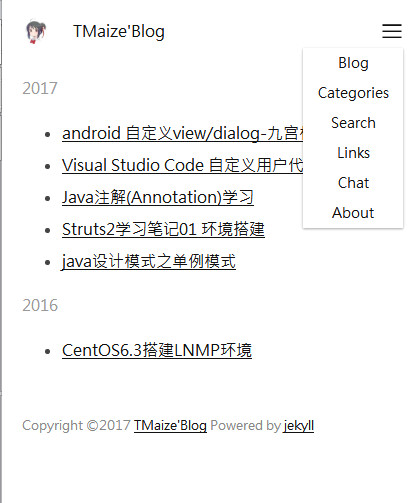

#simple-jekyll-theme

一款jekyll主题，简洁纯净，支持自适应

[GitHub地址](https://github.com/TMaize/simple-jekyll-theme)

[本项目预览](http://tmaize.oschina.io/simple-jekyll-theme/) ,[我的Blog预览](http://blog.tmaize.net)

## 截图






## 配置

配置参考我的博客[https://github.com/TMaize/my-blog](https://github.com/TMaize/my-blog)

+ 把simple-jekyll-theme替换成你的目录名


```
encoding: utf-8
title: 标题

baseurl: /simple-jekyll-theme
categoriesurl: /simple-jekyll-theme/pages/categories
searchurl: /simple-jekyll-theme/pages/search
linksurl: /simple-jekyll-theme/pages/links
chaturl: /simple-jekyll-theme/pages/chat
abouturl: /simple-jekyll-theme/pages/about

# 用于多说评论 填入留言板地址
# realchaturl: http://xxx.xxx/simple-jekyll-theme/pages/chat

cssurl: /simple-jekyll-theme/static/css
jsurl: /simple-jekyll-theme/static/js

permalink: /posts/:title.html
```

+ 如果是域名根目录使用下面的配置

```
encoding: utf-8
title: 标题

baseurl: /
categoriesurl: /pages/categories
searchurl: /pages/search
linksurl: /pages/links
chaturl: /pages/chat
abouturl: /pages/about

# 用于多说评论 填入留言板地址
# realchaturl: http://xxx.xxx/pages/chat

cssurl: /static/css
jsurl: /static/js

permalink: /posts/:title.html
```

## 插入图片

图片资源放在posts目录``

## 配置链接页在_data/link.json